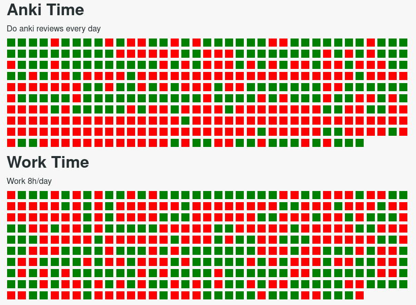

## Track



Something I use to track my goals, don't expect it to work for you as it's highly custom.
Feel free to take inspiration though

Setup is something like
```bash
pip install -r requirements.txt
python get_entries.py > entries.ndjson
python get_projects.py
```
Then run `python goals.py` to generate heatmap, open with `firefox ./index.html`
